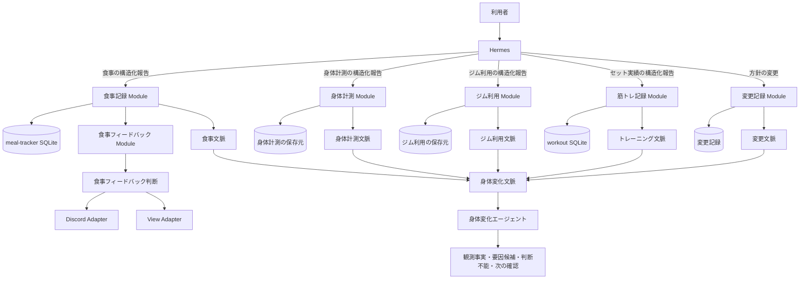
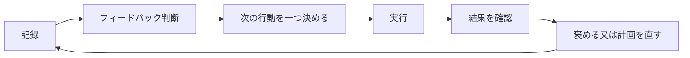

# 身体変化システムの最終設計

この文書は、身体変化システム全体の要件の正本です。
`meal-tracker`での具体的な変更順は、[食事フィードバック実装計画](https://github.com/ramenumaiwhy/meal-tracker/blob/main/docs/meal-feedback-implementation-plan.md)で管理します。

## 1. 目的

このシステムは、食事、身体計測、ジム利用、筋トレ実績を記録します。
記録だけでは終わりません。記録から次の行動を一つ決め、その行動を実行できたか確認します。

システムが答える問いは次のとおりです。

- 何を記録したか。
- 目標からどの程度離れているか。
- 記録がない日はいつか。
- どの行動が続いているか。
- 失敗後に通常の行動へ戻れたか。
- 身体又は筋力にどの変化があったか。
- 変化に関係した可能性がある要因は何か。
- 次に確認することは何か。

記録の目的は、数字を集めることではありません。
自分の行動と身体の変化の関係を学び、次の判断を改善することです。

## 2. 対象範囲

システムは、次の二つのループを持ちます。

### 2.1 食事行動ループ

食事の報告から、日次と週次のフィードバックを返します。
未記録、目標との差、反復する食事パターン、失敗後の復帰を扱います。

### 2.2 身体変化ループ

食事、身体計測、ジム利用、セット実績、方針の変更を同じ期間で比較します。
観測事実、要因候補、判断できないこと、次の確認を返します。

食事行動ループは単独で動きます。
身体変化ループは、各記録Moduleの準備ができた後に接続します。

## 3. 設計原則

### 3.1 事実と助言を分ける

記録Moduleは事実を所有します。
食事フィードバックModuleと身体変化エージェントは、事実を読んで判断します。

### 3.2 欠測と0を分ける

未記録日は0 kcalではありません。
期間平均は記録済み日だけで計算し、記録日数を必ず表示します。
記録率が低い場合は、傾向判断を保留します。

### 3.3 実施日と報告日を分ける

食べた日時は`eaten_at`へ保存します。
Discordで報告した日時は`reported_at`へ保存します。
翌日に報告しても、食事実績は実際に食べた日に属します。

### 3.4 行動を評価し、人格を評価しない

未記録や大幅超過は、明確に問題として扱います。
意志、自制心、性格、人としての価値は評価しません。

### 3.5 合否ではなく距離を示す

通常の表示では、目標との差、期間平均、反復回数を示します。
一日の食事を合格又は不合格にはしません。

### 3.6 次の行動は一つにする

一回のフィードバックで提案する行動は一つです。
長い助言一覧は返しません。

### 3.7 復帰を重要な成功として扱う

失敗しないことだけを成功とはしません。
未記録又は食べ過ぎの後、通常の記録と食事へ戻る行動を強く評価します。

### 3.8 因果関係を断定しない

個人の観測記録だけでは、因果関係を証明できません。
システムは`要因候補`を返します。

### 3.9 小さいInterfaceの後ろへ複雑さを隠す

期限、目標、欠測、反復、推定値、安全規則は、食事フィードバックModuleのImplementationへ隠します。
Discord AdapterとView Adapterは、同じフィードバック判断を表示します。

## 4. 用語

`CONTEXT.md`は、食事、身体及び筋トレに固有の用語を定義します。
正本とAdapterは一般的な設計用語のため、本書だけで定義します。

### 4.1 システム用語

**Hermes**:
Discordで利用者の自然文を受け取り、記録Moduleを呼び出して応答する対話エージェントです。記録の正本は所有しません。

**正本**:
同じ事実が複数の場所にある場合に、最終的に正しいと扱う保存元です。

**Adapter**:
構造化した判断をDiscord又はViewの表示へ変換するModuleです。独自の判定規則は持ちません。

**View**:
食事、身体及び筋トレの記録と傾向を確認する、読み取り専用の画面です。

### 4.2 記録と行動の用語

**PFC**:
たんぱく質（P）、脂質（F）、炭水化物（C）の量です。

**食事実績**:
実際に食べた品目と、その時点で採用したkcal及びPFCの写しです。

**食事日**:
食事実績が属するJSTの暦日です。報告日ではなく、食べた日時から決めます。

**未記録**:
対象の食事日に食事実績が一件もない状態です。0 kcalを意味しません。

**補完期限**:
未記録の食事を通常の追記として扱う期限です。既定値は翌日23:30 JSTです。

**復帰**:
未記録又は目標から大きく外れた後に、記録を補完するか、通常の食事行動へ戻ることです。

**食事フィードバック**:
食事実績、目標、記録状態、期間傾向から作る、事実、注意、称賛、次の行動のまとまりです。

**食事文脈**:
対象期間の食事実績、目標、記録状態及びデータ品質をまとめた派生情報です。

**身体計測文脈**:
対象期間の身体計測と測定条件をまとめた派生情報です。

**ジム利用文脈**:
対象期間のジム利用をまとめた派生情報です。

**変更文脈**:
対象期間の体づくり期間、変更記録及び期待する結果指標をまとめた派生情報です。

**行動支援**:
利用者が次の行動を選び、実行し、再確認することを助ける責務です。独立した記録所有者にはしません。

**体づくり期間**:
増量、減量又は維持など、一つの目的を持つ期間です。

**変更記録**:
結果を変える意図で、食事又はトレーニングの方針を変えた事実です。

**実行実績**:
変更した方針を、実際にどの程度実行したかを示す事実です。

**結果指標**:
身体又はパフォーマンスの変化を見る値です。体重、身体計測、主要種目の重量及び回数が該当します。

**要因候補**:
観測した変化又は非変化に関係した可能性がある項目です。

**次の確認**:
要因候補を区別するために、次の期間で一つだけ変えるか、追加で測る項目です。

## 5. 利用者体験

主な会話面はDiscordに固定します。
Hermesは利用者の自然文を理解し、記録Moduleの構造化Interfaceを呼びます。

### 5.1 食事を報告する

```text
利用者:
昼はおにぎり2個とサラダチキン。

Hermes:
昼食として記録しました。
合計は620 kcal、P 34gです。
```

### 5.2 記録内容を確認する

```text
利用者:
今日、何を記録したっけ。

Hermes:
朝食、昼食、夕食の順に、品目とkcal及びPFCを返します。
```

人向けViewでも、日ごとの品目を確認できます。

### 5.3 後から記録する

```text
利用者:
昨日の夕食は牛丼大盛り。

Hermes:
昨日の夕食として追加しました。
昨日の日別合計と7日平均を更新しました。
```

### 5.4 食事フィードバックを受ける

```text
今日は目標2000 kcalに対して+520 kcalです。
単日の大幅超過です。これは良くありません。
ただし、正確に記録したことは評価できます。
次の食事から通常目標へ戻してください。
```

### 5.5 未記録から復帰する

```text
昨日の記録を補完できました。
未記録を放置せず、通常運用へ戻した行動はとても良いです。
```

## 6. 全体構造



各保存元は、その記録Moduleが所有する事実の正本です。
共通DBは作りません。
身体変化エージェントは保存元を直接読みません。

## 7. Moduleの責務

### 7.1 食事記録Module

`meal-tracker`が担当します。

- 食品基準と出典を保存する。
- 食事実績へkcal及びPFCの写しを保存する。
- 実施日時と報告日時を分ける。
- 訂正、取消、遅い追記を扱う。
- 未記録日を0として扱わない。
- 目標履歴を有効日付きで保存する。
- 対象期間の事実をJSONで返す。
- 要因候補を判定しない。

食品基準を後から修正しても、過去の食事実績は自動変更しません。

### 7.2 身体計測Module

食事記録Moduleとは独立して、次を担当します。

- 体重、筋肉量、体脂肪などの実測値を保存する。
- 測定日時、測定機器及び測定条件を保存する。
- 訂正と取消を扱う。
- 対象期間の身体計測文脈を返す。
- 要因候補を判定しない。

実装と保存先は、身体計測を扱う作業で決めます。

### 7.3 ジム利用Module

食事記録Module及び筋トレ記録Moduleとは独立して、次を担当します。

- ジムへ入館した日時を保存する。
- 訂正と取消を扱う。
- 対象期間のジム利用文脈を返す。
- セット実績を保存しない。
- 要因候補を判定しない。

実装と保存先は、ジム利用を扱う作業で決めます。

### 7.4 食事フィードバックModule

`meal-tracker`の内側に置く深いModuleです。
独立したプロセス又はリポジトリにはしません。

外部Interfaceは一つです。

```text
decide_meal_feedback(con, scope, now) -> MealFeedbackDecision
```

`con`は、呼び出し元が渡すSQLite接続です。
食事フィードバックModuleは接続を開閉せず、食事実績及び目標を変更しません。
`now`はUTC offsetを持つ時刻です。Moduleの内側でJSTへ変換します。

`scope`は次の型です。

```text
MealFeedbackScope
  report_kind
    daily
    weekly
  start_date
  end_date
```

`daily`では`start_date`と`end_date`を同じ食事日にします。
`weekly`では月曜日から日曜日までの7暦日を指定します。
日付はJSTで解釈します。

Implementationは次を隠します。

- 日次又は週次の対象範囲検証
- 食事日の記録状態
- 補完期限
- 有効な目標
- 単日の目標差
- 直近3日の反復
- 7日平均と記録率
- 14日傾向
- 推定値とデータ品質
- 称賛の対象
- 注意の強さ
- 安全停止
- 次の行動一つ
- 再確認の要否

Discord AdapterとView Adapterは、このInterfaceの結果を使います。
各Adapterが独自に食事を判定してはいけません。

### 7.5 筋トレ記録Module

`agent-workout-tracker`が担当します。

- セット実績を保存する。
- 訂正と取消を履歴付きで扱う。
- トレーニングを自動でまとめる。
- 同じ依頼の再送で記録を増やさない。
- トレーニング文脈をJSONで返す。
- 種目別の重量推移を返す。
- 要因候補を判定しない。

### 7.6 変更記録Module

次を保存します。

- 体づくり期間
- 変更開始日
- 変更対象
- 変更前と変更後
- 変更の意図
- 期待する変化

最初は身体変化エージェントと同じImplementation内に置きます。
二つ目の利用元ができるまで、独立したSeamは作りません。

### 7.7 身体変化エージェント

- 各Moduleの読み取りInterfaceだけを使う。
- 同じ期間へそろえて比較する。
- 事実、要因候補、判断不能を分ける。
- 変更記録がない意図を後から作らない。
- 複数変更が重なった場合は、個別の影響を特定できないと示す。
- 次の確認を一つに絞る。
- 元の記録を変更しない。
- 医療判断をしない。

## 8. 食事目標

食事目標は有効日付きで保存します。
過去の食事は、その日に有効だった目標で評価します。

初期の目標候補は次のとおりです。

| 目的 | 目標kcal | P下限 |
|---|---:|---:|
| 維持 | 2200 | 120g |
| ゆるく減量 | 2000 | 120g |
| 標準減量 | 1800 | 120g |
| 増量 | 2450 | 120g |

これらは一般的な臨床基準ではありません。
この利用者の初期運用で使う値です。
初期運用では、`ゆるく減量`を有効にします。

食事行動ループだけを使う期間では、候補の目標kcalを自動変更しません。
食事実績だけでは、維持に必要なkcalを確定できないためです。

目標選択時は、直近28暦日の次の事実を表示します。

- 記録率
- 翌日以降の追記率
- 記録済み日の平均kcal
- 日ごとの変動
- 高カロリー日と低カロリー日
- P下限の達成日数
- 各候補目標と過去実績の距離

28暦日のうち14日以上に食事実績がある場合は、各候補について次を表示します。

- 記録済み日の中央値と候補の差
- 候補の±10%以内だった日数
- 候補より20%以上高い日数と低い日数

表示順は、利用者が選んだ目的に合う候補を先頭にします。
同じ目的の候補が複数ある場合は、±10%以内だった日数が多い候補を先にします。
同数の場合は、記録済み日の中央値との差が小さい候補を先にします。
実績との距離は実行可能性の参考です。候補の正しさ又は消費kcalの推定には使いません。
記録日が14日未満の場合は、情報不足と表示し、初期値をそのまま提示します。

身体変化ループの接続後は、食事実績、体重傾向及び実行実績を二週間以上確認してから、目標変更を提案できます。
目標値は自動変更しません。利用者が承認した日から新しい目標を有効にします。

期限又は自制心を質問して目標を決めません。
過去の実行可能性を示し、利用者が目的を選びます。

## 9. 食事日の記録状態

記録状態は、有効な食事実績、最初の報告日時及び現在時刻から導出します。
正本として重複保存しません。

| 状態 | 条件 | 応答 |
|---|---|---|
| `open` | 対象日が当日で、現在時刻が23:30より前 | 記録の有無に関係なく、途中経過だけを返す |
| `logged` | 23:30までに食事実績が一件以上ある | 23:30以降に日別評価へ進む |
| `provisional_missing` | 当日23:30以上、翌日23:30未満で食事実績がない | 暫定未記録として追記を促す |
| `overdue_missing` | 翌日23:30以上で食事実績がない | 重大な未記録として強く注意する |
| `backfilled` | 最初の食事実績を対象日の23:30後に報告した | 再計算し、復帰を評価する |

判定は表の上から行います。
取消済みの食事実績は件数に含めません。

未記録の注意は、食事内容が悪かったという推定ではありません。
分析と支援ができないことを問題にします。

未記録への文例:

```text
昨日の食事が未記録です。
食べ過ぎより、記録がない方が調整できず困ります。
思い出せる範囲で、最低限の品目だけ補完してください。
```

## 10. 食事フィードバック判断

`MealFeedbackDecision`は、文字列ではなく構造化した値を返します。

```text
MealFeedbackDecision
  feedback_id
  revision
  scope
    report_kind
    start_date
    end_date
  generated_at
  goal_ids[]
  record_states[]
    date
    state
  recorded_entries[] MealEntrySummary
  severity
  facts[]
  data_quality[]
  praise?
    kind
    reason
  concern?
    kind
    reason
  action?
    instruction
    success_condition
    followup_on
  needs_followup
  evidence_ids[]
  evidence_fingerprint
```

配列と`kind`は、次の型を使います。

```text
Fact
  kind
    record_state
    energy_total
    energy_goal_distance
    protein_goal_distance
    seven_day_average_energy
    seven_day_plan_distance
    fourteen_day_energy_trend
    logged_day_count
    backfilled_day_count
    energy_goal_exceeded_day_count
    protein_goal_met_day_count
  message
  value? number
  unit?
    kcal
    g
    percentage_point
    day

DataQualityNotice
  kind
    insufficient_logged_days
    estimated_entry
    unknown_amount
    missing_reported_at
    ambiguous_reported_at
  message

Praise
  kind
    honest_logging
    backfill
    recovery
    weekly_consistency
    target_proximity
  reason

Concern
  kind
    overdue_missing
    large_deviation
    repeated_deviation
    repeated_low_protein
    safety_risk
  reason

MealEntrySummary
  entry_id
  meal_label
  eaten_at
  reported_at
  items[]
    name
    amount_text?
    kcal
    protein_g
    fat_g
    carbs_g
    source_kind
    is_estimated
```

`message`と`reason`は表示用の文字列です。
Adapterは文字列を解釈しません。
表示形式を変える場合だけ、`kind`を使います。
`kind`は閉じた列挙値です。
定義にない値はInterface違反として処理を失敗させます。

`feedback_id`は、レポート種別と対象日又は対象期間から作る固定IDです。
同じ対象の再計算でも変えません。
`revision`は1から始め、根拠識別値が変わるたびに1増やします。
根拠識別値が同じ再実行では、`revision`を増やしません。
`goal_ids`は対象範囲の各日に有効な目標を重複なしで返します。
日次判断では一日分、週次判断では7日分の`record_states`を返します。

`severity`は次のいずれかです。

- `information`: 事実表示だけ
- `praise`: 良い行動を明確に評価
- `warning`: 単日の問題を明確に注意
- `intervention`: 未記録又は反復パターンへ行動変更を要求
- `safety_hold`: 通常の減量又は増量指導を停止

これは一日の合否ではありません。
フィードバックの強さです。

## 11. 目標からの乖離規則

### 11.1 単日の大幅乖離

有効な目標kcalから20%以上離れた場合は、同日に強く注意します。
2000 kcal目標では2400 kcal以上又は1600 kcal以下です。

増量、減量及び維持の全てで、目標の上側と下側を確認します。
増量中の不足と、減量中の超過は、目的を妨げる乖離として明示します。
反対方向の乖離も、計画が極端でないか確認するために表示します。

```text
今日は目標から20%以上外れています。
これは良くありません。
要因候補を一つ確認し、次の食事から通常目標へ戻してください。
```

20%は実装用の初期値です。確立した臨床閾値ではありません。
運用データから再調整できます。

### 11.2 小さな乖離の反復

直近3暦日のうち2日以上で、同じ方向に目標から外れた場合は、反復として扱います。
各日は、その日に有効な目標と比較します。
日ごとの通常変動を反復と誤認しないため、目標の±10%以内は中立として扱います。
未記録日は乖離として数えません。未記録規則を優先します。

反復時は、声を強くするだけでは不十分です。
食事時刻、外食、酒、間食、空腹、予定又は記録負担から要因候補を一つ確認します。

### 11.3 7日平均

次を満たす場合は、計画確認を行います。

- 7暦日のうち5日以上を記録している。
- 記録済み日の摂取合計が、同じ日々の目標合計から10%以上離れている。

目標が期間中に変わっても、各日の有効な目標を使います。
表示用には、記録済み日の7日平均と、同じ日々の目標平均を併記します。

この規則は利用者を叱るために使いません。
目標又は食事計画が機能しているか確認するために使います。

### 11.4 極端な不足

個人用の安全下限は1500 kcalです。
下限未満の日を減量成功として褒めません。

食べ過ぎの翌日も、罰として極端に減らしません。
通常の目標へ戻します。

### 11.5 P下限

日次では、P下限までの距離を表示します。
一日の不足だけで強い注意はしません。

直近3件の`logged`又は`backfilled`のうち2件以上でP下限を下回った場合は、反復として扱います。
次の食事で追加できる、通常の食品を一つ提案します。
サプリメント又は極端な高P摂取を自動で勧めません。

## 12. 褒める優先順位

褒める対象は、制御できる行動を優先します。

### 12.1 最も頻繁に褒める

- 食事を正直に記録した。
- 超過した日も隠さず記録した。

### 12.2 最も強く褒める

- 未記録を補完した。
- 食べ過ぎの後、通常目標へ戻った。
- 週単位で記録と食事行動を続けた。

### 12.3 短く褒める

- 単日のkcalとPが目標に近かった。

### 12.4 節目で祝う

- 複数週の食事傾向が改善した。
- 体重、身体計測又は筋力の傾向が目的に沿って変化した。

### 12.5 褒めない

- 単日の体重低下
- 極端な低カロリー
- 過剰なP
- 罰としての食事制限又は運動
- 意志が強いなどの人格評価

記録と食事内容は別の軸で評価します。

```text
記録したことは良いです。
一方で、今日の摂取量は大幅に超えています。
記録があるため、要因候補を確認して次の食事から戻せます。
```

## 13. 閉じたフィードバックループ



問題が単日で終わらない場合だけ、理由を一つ確認します。
毎回長い質問はしません。

要因候補の初期分類は次のとおりです。

- 予定又は時間
- 食品の準備不足
- 外食又は会食
- 酒
- 強い空腹又は削りすぎ
- ストレス又は睡眠不足
- 記録を忘れた
- 不明

次の行動には、成功条件と確認日を付けます。

```text
行動:
明日の昼食を前夜に決める。

成功条件:
翌日の昼食を15:00までに記録する。

確認:
翌日の23:30レポート。
```

同じ助言を繰り返す前に、前回の行動結果を確認します。
実行できなかった場合は、人格ではなく、行動の大きさ又は環境を見直します。

## 14. レポートの時間設計

### 14.1 当日の途中経過

利用者が要求した時だけ返します。
現在の合計、目標までの距離、P下限までの距離を表示します。
当日の途中では、一日の評価を行いません。

### 14.2 23:30の日次スナップショット

毎日23:30 JSTに生成します。

- 当日の品目
- 当日のkcal及びPFC
- 有効な目標との差
- 7日平均と記録日数
- 注意又は称賛
- 次の行動一つ

このレポートは暫定です。
後から食事を追加した場合は再計算します。

### 14.3 翌日23:30の未記録確認

同じ定期実行で前日も確認します。
前日が未記録のままなら、`overdue_missing`として強く注意します。

### 14.4 週次レビュー

前週の全ての補完期限が過ぎた後に生成します。
月曜日から日曜日を対象にする場合、月曜日23:30以降に生成します。

- 7日中の記録日数
- 補完した日数
- 目標超過日数
- 7日平均
- P下限の達成日数
- 最も良かった行動
- 放置できない反復パターン
- 次週の行動一つ

### 14.5 複数週の計画確認

7日傾向が続いた場合に実施します。
食事だけで目標kcalを自動変更しません。
身体変化ループが接続済みの場合は、体重とパフォーマンスの傾向も確認します。

## 15. 遅い追記とレポート更新

遅い追記があった場合は、次を再計算します。

- 対象日の合計
- 対象日を含む7日平均
- 対象日を含む14日傾向
- 週次レビュー
- View

同じ対象日へ矛盾するDiscordレポートを増やしません。
食事フィードバック判断は`evidence_fingerprint`（根拠識別値）を返します。

- 根拠識別値が同じなら再送しない。
- 根拠識別値が変わったら、既存メッセージを更新する。
- 更新できない場合は、以前のレポートを置き換える訂正文を一件送る。

Discord Adapterは、固定した`feedback_id`と`discord_message_id`の対応を保存します。
新しい`revision`は、同じDiscordメッセージへ反映します。

## 16. データ品質と推定値

食事実績は、次の優先順位で栄養値を決めます。

1. 既知のローカル食品基準
2. 飲食店の公式栄養情報
3. 商品の公式栄養情報
4. 信頼できる栄養DBからの換算
5. 一般的な推定

各食事実績は`source_kind`と根拠を保持します。
推定値を確定値のように表示しません。

次の場合は強い判断を保留又は弱めます。

- 記録日数が不足している。
- 一般推定が一日の大部分を占める。
- 目標との差が判定用の余白内にある。
- 食べた量が不明である。
- 身体計測の条件が大きく異なる。

任意の信頼度点数は作りません。
欠測、推定、測定条件を事実として表示します。

## 17. 安全規則

次の場合は通常の減量又は増量フィードバックを止め、`safety_hold`にします。

- 極端な低摂取が反復する。
- 過食と極端な制限が交互に続く。
- 嘔吐、下剤、失神、強いめまいなどの報告がある。
- 急な意図しない体重変化がある。
- 摂食障害を疑う発言がある。

`safety_hold`では、叱責、目標の強化、罰的な補償を行いません。
必要に応じて医師又は管理栄養士への相談を勧めます。
システムは診断をしません。

## 18. 人向けView

Viewは、判断と確認に必要な情報だけを表示します。
入力機能は持ちません。

### 18.1 今日

- 今日の合計kcal及びPFC
- 有効な目標
- 目標までの距離
- 記録した品目
- 最新の食事フィードバック
- 未完了の次の行動

### 18.2 食事傾向

- 日別合計
- 7日移動平均
- 期間ごとの目標線
- 未記録日の途切れ
- 記録日数
- 凡例

日別合計と7日平均は、色、線種、凡例を変えます。
同じ線に見える表示にはしません。

### 18.3 食事履歴

- 日ごとの記録有無
- 品目一覧
- 食事ごとのkcal及びPFC
- 遅い追記の表示
- 推定値の表示

利用者は「何を記録したか」をViewだけで確認できます。

### 18.4 身体とジム

- 体重、筋肉量、体脂肪の期間推移
- 測定日の実測値
- ジム利用の週別頻度

### 18.5 筋トレ

- 直近のトレーニングの日付とセット数
- 種目、外部負荷、回数及び同じ実績のセット数
- 同じ種目の2回以上の実績がある場合の推移
- 自重種目では外部負荷ではなく回数の推移

View Adapterは`workout context --json`及び`workout progress --json`を使います。
筋トレ記録ModuleのSQLiteを直接読みません。
読み取りに失敗した場合も、食事、身体及びジムのViewは生成します。

Viewは要因候補を断定しません。

## 19. 機械向け読み取りInterface

各記録Moduleは、安定したJSONを返します。
SQLiteの保存構造を利用者へ公開しません。

### 19.1 食事文脈

```text
schema_version
generated_at
timezone
period

nutrition
  goals
  days
    date
    record_state
    entries[] MealEntrySummary
    kcal
    protein_g
    fat_g
    carbs_g
  summary
    calendar_days
    logged_days
    missing_days
    average_kcal_per_logged_day

data_quality
  source_kind_counts
  entries_without_reported_at
  entries_reported_after_eaten_day
  estimated_entries
```

`date`は`YYYY-MM-DD`、日時は時差を含むISO 8601形式で返します。
kcalはkcal、PFCはg、日数と件数は整数で返します。
`average_kcal_per_logged_day`は、記録済み日だけを対象にした一日当たりの平均kcalです。
`MealEntrySummary`は、食事フィードバック判断と同じ型を使います。

このInterfaceは事実だけを返します。
要因候補又は次の行動を返しません。

### 19.2 身体計測文脈

- 測定日時
- 体重、筋肉量、体脂肪などの実測値
- 測定機器
- 測定条件
- 有効な身体計測ID

### 19.3 ジム利用文脈

- 入館日時
- 期間内の利用回数
- 週ごとの利用回数
- 有効なジム利用ID

### 19.4 トレーニング文脈

- 現在のトレーニング
- 種目別の直近実績
- 有効なセット実績ID
- 重量と回数の推移
- 前回実施日からの日数

### 19.5 変更文脈

- 体づくり期間
- 変更記録
- 期待した結果指標

## 20. 身体変化文脈

身体変化文脈は、各Moduleの事実から都度作る派生情報です。
共通の保存形式にはしません。

```text
文脈情報
  schema_version
  generated_at
  timezone

対象期間
  開始日
  終了日

体づくり期間
  目的
  目標
  判断に使う結果指標

変更記録
  開始日
  対象
  変更前
  変更後
  意図
  期待する変化

実行実績
  食事記録率
  食事期間平均
  復帰実績
  ジム頻度
  主要種目の推移

結果指標
  体重の傾向
  身体計測の傾向
  主要種目の傾向

データ品質
  欠測
  推定
  測定間隔
  比較条件

根拠参照
  記録Module
  記録ID
  対象期間
```

## 21. 身体変化エージェントの出力

出力順は固定します。

1. 観測事実
2. 要因候補
3. 判断できないこと
4. 次の確認

例:

```text
観測事実:
摂取kcalの7日平均は増えました。体重と主要種目の重量は横ばいです。

要因候補:
食事目標の変更幅が小さかった可能性があります。

判断できないこと:
食事の未記録日があるため、実際の期間平均は確定できません。
食事とトレーニングを同じ週に変更したため、個別の影響は区別できません。

次の確認:
次の2週間はトレーニング方針を変えず、食事記録の欠測を減らします。
```

## 22. 保存する追加情報

各記録Moduleが所有する事実に加え、次を保存します。

### 22.1 フィードバックイベント

- `feedback_id`
- `revision`
- 対象日又は対象期間
- 生成日時
- 種類
- severity
- evidence_fingerprint
- 称賛理由
- 注意理由
- 次の行動
- 成功条件
- 確認日
- 未完了、完了又は置換済みの状態
- 置き換え元の`revision`

派生したkcal及びPFCを別の正本として保存しません。
根拠IDから再計算できる状態を保ちます。

### 22.2 配信結果

- `feedback_id`
- `revision`
- 配信先
- `discord_message_id`
- 送信又は更新日時
- 配信結果

### 22.3 変更記録

- 体づくり期間
- 変更内容
- 意図
- 期待する変化

## 23. セキュリティとプライバシー

食事実績と身体計測は、個人の機微な情報として扱います。

- 設定したDiscord利用者からの入力だけを受ける。
- Discordボット及び外部サービスの認証情報をリポジトリへ保存しない。
- SQLiteとバックアップへ、必要なローカル利用者だけがアクセスできるようにする。
- AIエージェントへ渡す情報は、対象期間と判断に必要な項目へ限定する。
- 運用ログへ認証情報、食事原文及び身体計測の全内容を出さない。
- 訂正と取消は監査用の履歴を残す。通常の読み取り結果からは無効な記録を除く。
- バックアップから戻せることを定期的に確認する。

Discordへ送る日次レポートは、固定した食事レポート用チャンネルへ送ります。
入力チャンネルは制限しません。
チャンネルallowlistはHermes全体へ効くため、利用者IDのallowlistだけを使います。

## 24. 定期実行と障害処理

日次及び週次レポートは、再実行できる同じ処理として実装します。

- レポート種別、対象日又は対象期間を実行識別子にする。
- 同じ実行識別子の再試行で、Discordメッセージを増やさない。
- 定期実行を逃した場合は、次回起動時に未実行分を順に補完する。
- 配信失敗を保存し、次回に再試行する。
- 記録保存に失敗した場合は、記録完了と応答しない。
- 一部のModuleを読めない場合は、読めた範囲と欠けた範囲を明示する。
- 定期実行の開始、完了、失敗及び対象期間を運用ログへ残す。

障害時も、推定した値で欠測を埋めません。

## 25. 作らないもの

- 共通DB
- イベント基盤
- ベクトルDB
- 機械学習による自動因果判定
- 自動診断
- 人格又は自制心の点数
- 一日の合否スコア
- 食べ過ぎ後の罰的な食事制限
- 全記録Moduleを包む汎用の枠組み
- Web入力画面
- 複数利用者機能

初期の食事指導は、kcal、PFC、記録行動、復帰、期間傾向を扱います。
食物繊維、野菜、塩分、酒などの食事品質は、記録精度と利用価値を確認した後に追加します。

## 26. 実装順

### 段階1: 食事フィードバック判断

- `decide_meal_feedback`を作る。
- `daily`の対象範囲を実装する。
- 記録状態と補完期限を実装する。
- 単日、反復、7日平均の規則を実装する。
- 称賛と安全規則を実装する。
- DiscordとViewを同じ判断へ接続する。

### 段階2: 閉じた行動ループ

- フィードバックイベントを保存する。
- 次の行動、成功条件、確認日を保存する。
- 復帰を検出する。
- Discordメッセージを更新又は置換する。
- 同じInterfaceへ`weekly`の対象範囲を追加する。

### 段階3: 身体計測とジム利用

- 身体計測Moduleを実装する。
- ジム利用Moduleを実装する。
- 各Moduleの読み取りInterfaceを固定する。
- 食事記録及び筋トレ記録から独立して訂正と取消を検証する。

### 段階4: 身体変化分析

- 変更記録Moduleを実装する。
- 食事文脈、身体計測文脈、ジム利用文脈、トレーニング文脈及び変更文脈を統合する。
- 身体変化文脈を作る。
- 身体変化エージェントの出力順を固定する。

### 段階5: 実利用による調整

- 4週間運用する。
- 注意の閾値と通知量を確認する。
- 同じ助言が反復していないか確認する。
- 記録負担より判断改善が大きいか確認する。
- 判断が改善しない機能は増やさない。

## 27. 検証条件

### 27.1 食事記録

- 実施日と報告日を別に保存できる。
- 翌日の追記が実際の食事日へ入る。
- 未記録日を0 kcalとして計算しない。
- 訂正後に日別、7日、14日の値が更新される。
- 記録した品目をDiscordとViewで確認できる。
- 食事文脈と食事フィードバック判断が、品目、食事区分及び食事ごとのkcalとPFCを返す。

### 27.2 記録状態

- 当日23:30より前の未記録を評価しない。
- 当日23:30の未記録を暫定として扱う。
- 翌日23:30以降の未記録を強く注意する。
- 補完後に`backfilled`を検出する。

### 27.3 目標からの乖離

- 目標から上下に20%以上離れた日を単日の大幅乖離として扱う。
- 直近3日中2日の同方向の乖離を反復として扱う。
- 7日中5日未満の記録では平均による強い判断をしない。
- 記録済み日の摂取合計が、同じ記録済み日の目標合計から10%以上離れた場合に計画確認を返す。
- 目標変更をまたぐ期間で、各日の有効な目標を使う。
- 1500 kcal未満を褒めない。
- 食べ過ぎ後に極端な制限を勧めない。
- 直近3記録日中2日のP不足を反復として扱う。

### 27.4 称賛

- 超過日を記録した行動と、超過そのものを別に評価する。
- 未記録の補完を強く褒める。
- 食べ過ぎ後の復帰を強く褒める。
- 週単位の一貫性を褒める。
- 単日の体重低下を強く褒めない。

### 27.5 配信

- 同じInterfaceから日次判断と週次判断を生成する。
- 日次と週次の`feedback_id`を、レポート種別と対象範囲から一意に作る。
- 週次判断が補完日数、目標超過日数及びP下限達成日数を構造化して返す。
- 同じ根拠識別値を二重送信しない。
- 遅い追記後に既存レポートを更新又は置換する。
- 遅い追記後も`feedback_id`を変えず、`revision`を増やす。
- DiscordとViewが同じ判定を表示する。
- 週次レビューが補完期限後のデータを使う。

### 27.6 行動ループ

- 次の行動は一つだけ返す。
- 行動に成功条件と確認日がある。
- 次回に前回の実行結果を確認する。
- 実行できない場合は人格ではなく計画又は環境を直す。

### 27.7 身体変化分析

- 食事文脈に身体計測又はジム利用の値を含めない。
- 身体計測文脈とジム利用文脈を別のInterfaceから取得できる。
- 各ModuleのInterfaceだけで身体変化文脈を作れる。
- 観測事実と要因候補を分ける。
- 欠測又は同時変更時に判断不能を表示する。
- 次の確認を一つだけ返す。
- 因果関係又は医療診断を断定しない。

### 27.8 セキュリティと運用

- 設定外のDiscord利用者は記録できない。
- 設定した利用者は、他のDiscordチャンネルからも記録できる。
- 認証情報と食事原文を運用ログへ出さない。
- 同じ定期実行の再試行でDiscordメッセージを増やさない。
- 逃した定期実行を次回起動時に補完できる。
- 配信失敗を保存し、再試行できる。
- バックアップからSQLiteを復元できる。

## 28. 根拠

設計は、自己記録、問題解決、再発予防、本人中心の支援を組み合わせます。

- [NICE: Overweight and obesity management](https://www.nice.org.uk/guidance/ng246)
- [NICE: Behaviour change, individual approaches](https://www.nice.org.uk/guidance/ph49)
- [CDC: PreventT2 curriculum](https://www.cdc.gov/diabetes-prevention/php/lifestyle-change-resources/t2-curriculum.html)
- [CDC: Get Back on Track](https://www.cdc.gov/diabetes-prevention/media/pdfs/legacy/Coach-Module-25_Get_Back_on_Track.pdf)
- [USPSTF: Behavioral interventions for adults](https://www.uspreventiveservicestaskforce.org/uspstf/document/RecommendationStatementFinal/obesity-in-adults-interventions)
- [SMART trial: self-monitoring and feedback](https://pubmed.ncbi.nlm.nih.gov/22936524/)
- [Dietary self-monitoring systematic review](https://pubmed.ncbi.nlm.nih.gov/34412727/)

単日の20%、直近3日中2日、7日平均10%、補完期限翌日23:30は、個人用システムの実装値です。
確立した臨床閾値ではありません。
